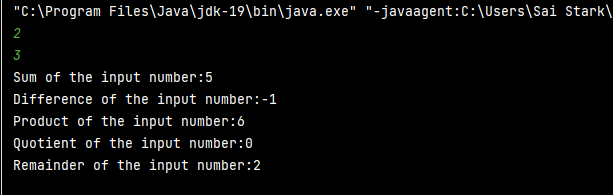
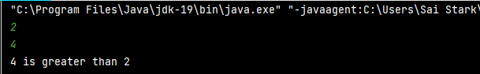
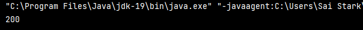
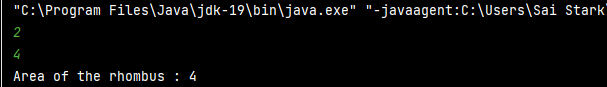
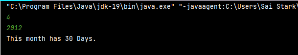
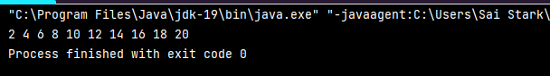
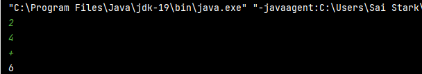
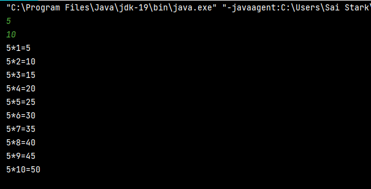

# JAVA WEEK 1 ASSIGNMENT SOLUTIONS WITH OUTPUT:

## 1.Write a Java program to print the sum, multiply, subtract, divide and remainder of two numbers.
```
 import java.util.Scanner;
 public class Main {
     public static void main(String[] args)
     {

        Scanner s=new Scanner(System.in);
        int a=s.nextInt();
        int b=s.nextInt();
        System.out.println("Sum of the input number:"+(a+b));
        System.out.println("Difference of the input number:"+(a-b));
        System.out.println("Product of the input number:"+(a*b));
        System.out.println("Quotient of the input number:"+(a/b));
        System.out.println("Remainder of the input number:"+(a%b));
     }
 }
```


## 2. Write a Java program to compare two numbers.
```
import java.util.Scanner;
public class Main {
    public static void main(String[] args)
    {
        Scanner s=new Scanner(System.in);
        int x=s.nextInt();
        int y=s.nextInt();
        if(x>y)
        {
            System.out.println(x+" is greater than "+y);
        }
        else if(x<y)
        {
            System.out.println(y+" is greater than "+x);
        }
        else
        {
            System.out.println("Both inputs are equal");
        }
    }
}
```



## 3.Write a Java program to convert a string to an integer
```
public class Main {
    public static void main(String[] args)
    {
        String sc="200";
        int i=Integer.parseInt(sc);
        System.out.println(i);
        
    }
}
```



## 4.Java Program to find area of rhombus
```
import java.util.Scanner;
public class Main {
    public static int rhombus(int p,int q)
    {
        return ((p*q)/2);
    }
    public static void main(String[] args)
    {
        Scanner s=new Scanner(System.in);
        int dia1=s.nextInt();
        int dia2=s.nextInt();
        System.out.println(rhombus(dia1,dia2));
        
    }
}
```



## 5. Write a Java program to find the number of days in a month.
```
import java.util.Scanner;
public class Main {
    public static void main(String[] args)
    {
        Scanner s=new Scanner(System.in);
        int month=s.nextInt();
        int year=s.nextInt();
        if((month==1)||(month==3)||(month==5)||(month==7)||month==8||month==10||month==12)
        {
            System.out.println("This month has 31 Days.");
        }
        else if((month==4)||(month==6)||(month==9)||(month==11))
        {
            System.out.println("This month has 30 Days.");
        }
        else
        {
            if ((year % 400 == 0) || ((year % 4 == 0) && (year % 100 != 0)))
            {
                System.out.println("This month has 29 Days.");
            }
            else
            {
                System.out.println("This month has 28 Days.");
            }

        }
    }
}
```



## 6.Write a Java program to print the even numbers from 1 to 20.
```
public class Main {
    public static void main(String[] args)
    {
        int i;
        for(i=1;i<=20;i++)
        {
            if(i%2==0)
            {
                System.out.println(i);
            }
        }
        
    }
}
```



## 7. Write a Java program to create a simple calculator.
```
import java.util.Scanner;
public class Main {
    public static void main(String[] args)
    {
        Scanner s=new Scanner(System.in);
        int re=s.nextInt();
        int se=s.nextInt();
        String sym=s.next();
        switch (sym)
        {
            case "+":
                System.out.println(re+se);
                break;
            case "-":
                System.out.println(re-se);
                break;
            case "*":
                System.out.println(re*se);
                break;
            case "/":
                System.out.println(re/se);
                break;
            case "%":
                System.out.println(re%se);
                break;
            case "&":
                System.out.println(re&se);
                break;
            case "|":
                System.out.println(re|se);
                break;

        }
        
    }
}
```



## 8.Write a Java program to print multiplication table of a number.
```
import java.util.Scanner;
public class Main {
    public static void main(String[] args)
    {
        Scanner s=new Scanner(System.in);
        int multab=s.nextInt();
        int n=s.nextInt();
        int i;
        for(i=1;i<=n;i++)
        {
            System.out.println(multab+"*"+i+"="+(multab*i));
        }
    }
}
```



